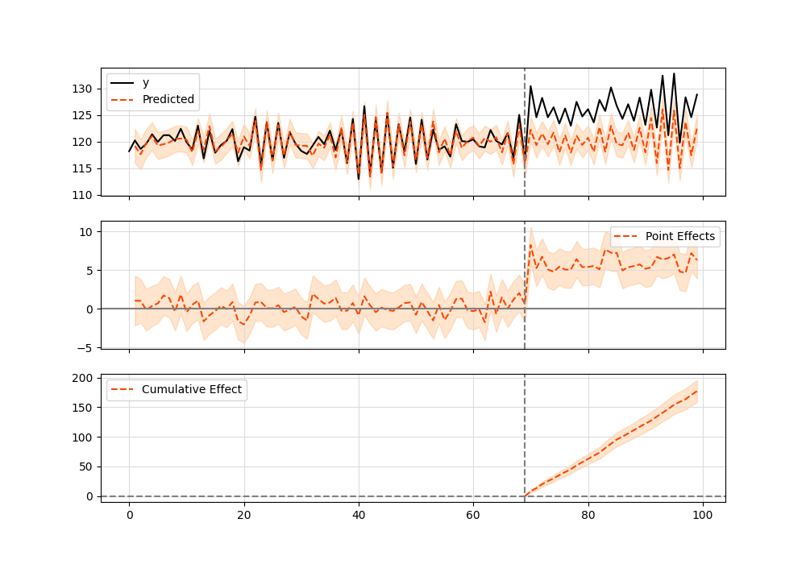
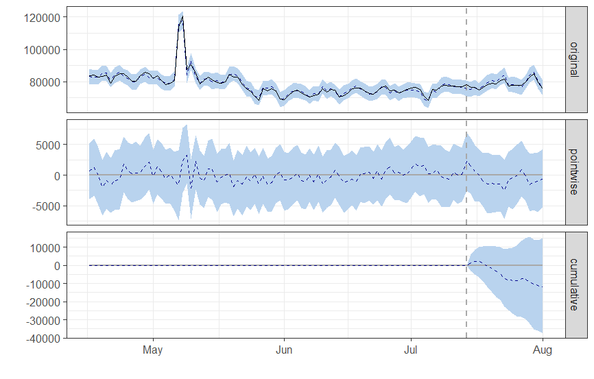
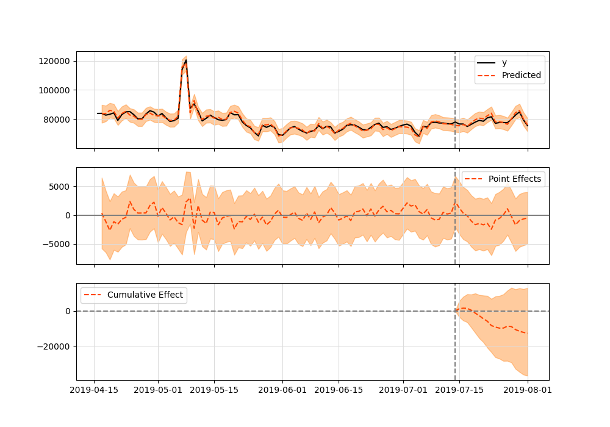

# tfcausalimpact
Google's [Causal Impact](https://github.com/google/CausalImpact) Algorithm Implemented on Top of [Tensorflow Probability](https://github.com/tensorflow/probability).

## How It Works
The algorithm basically fits a [Bayesian structural](https://en.wikipedia.org/wiki/Bayesian_structural_time_series) model on past observed data to make predictions on what future data would look like. Past data comprises everything that happened before an intervention (which usually is the changing of a variable as being present or not, such as a Marketing campaign that starts to run at a given point). It then compares the counter-factual (predicted) series against what was really observed in order to extract statistical conclusions about the impact that the variable under investigation causes on the response data.

Running the model is quite straightforward, it requires the observed data `y`, covariates `X` that helps explain `y` through a linear regression, a `pre-period` interval that selects everything that happened before the intervention and a `post-period` variable so to compare before versus after intervention.

It's important to keep in mind the main assumptions that this model makes in order ot run successfully: first and foremost, it's crucial that the covariates `X` are not affected by the variable being manipulated as otherwise it'll lead to wrong conclusions. In the example of the Marketing campaign, the covariates can be anything that might indicate a linear relationship with *Sales* and that won't be affect by the same campaign.

## Installation

    pip install tfcausalimpact

## Requirements

 - python{3.6, 3.7, 3.8, 3.9}
 - numpy
 - matplotlib
 - jinja2
 - tensorflow>=2.3.0
 - tensorflow_probability>=0.11.1


## Getting Started

We recommend this [presentation](https://www.youtube.com/watch?v=GTgZfCltMm8) by Kay Brodersen (one of the creators of the Causal Impact in R).

We also created this introductory [ipython notebook]() with examples of how to use this package.

This medium article also offers some ideas and concepts behind the library.

### Example

Here's a simple example (which can also be found in the original Google's R implementation) running in Python:

```python
import pandas as pd
from causalimpact import CausalImpact


data = pd.read_csv('tests/fixtures/arma_data.csv')
data.iloc[70:, 0] += 5

pre_period = [0, 69]
post_period = [70, 99]

ci = CausalImpact(data, pre_period, post_period)
print(ci.summary())
print(ci.summary(output='report'))
ci.plot()
```

Summary should look like this:

```
Posterior Inference {Causal Impact}
                          Average            Cumulative
Actual                    125.23             3756.86
Prediction (s.d.)         120.34 (0.31)      3610.28 (9.28)
95% CI                    [119.76, 120.97]   [3592.67, 3629.06]

Absolute effect (s.d.)    4.89 (0.31)        146.58 (9.28)
95% CI                    [4.26, 5.47]       [127.8, 164.19]

Relative effect (s.d.)    4.06% (0.26%)      4.06% (0.26%)
95% CI                    [3.54%, 4.55%]     [3.54%, 4.55%]

Posterior tail-area probability p: 0.0
Posterior prob. of a causal effect: 100.0%

For more details run the command: print(impact.summary('report'))
```

And here's the plot graphic:



## Google R Package vs TensorFlow Python

Both packages should give equivalent results. Here's an example using the `comparison_data.csv` dataset available in the `fixtures` folder. When running CausalImpact in the original R package, this is the result:

### R

```{r}
data = read.csv.zoo('comparison_data.csv', header=TRUE)
pre.period <- c(as.Date("2019-04-16"), as.Date("2019-07-14"))
post.period <- c(as.Date("2019-07-15"), as.Date("2019-08-01"))
ci = CausalImpact(data, pre.period, post.period)
```

Summary results:

```
Posterior inference {CausalImpact}

                         Average          Cumulative        
Actual                   78574            1414340           
Prediction (s.d.)        79232 (736)      1426171 (13253)   
95% CI                   [77743, 80651]   [1399368, 1451711]
                                                            
Absolute effect (s.d.)   -657 (736)       -11831 (13253)    
95% CI                   [-2076, 832]     [-37371, 14971]   
                                                            
Relative effect (s.d.)   -0.83% (0.93%)   -0.83% (0.93%)    
95% CI                   [-2.6%, 1%]      [-2.6%, 1%]       

Posterior tail-area probability p:   0.20061
Posterior prob. of a causal effect:  80%

For more details, type: summary(impact, "report")
```

And correspondent plot:



### Python

```python
import pandas as pd
from causalimpact import CausalImpact


data = pd.read_csv('tests/fixtures/comparison_data.csv', index_col=['DATE'])
pre_period = ['2019-04-16', '2019-07-14']
post_period = ['2019-7-15', '2019-08-01']
ci = CausalImpact(data, pre_period, post_period)
```

Summary is:

```
Posterior Inference {Causal Impact}
                          Average            Cumulative
Actual                    78574.42           1414339.5
Prediction (s.d.)         79282.92 (727.48)  1427092.62 (13094.72)
95% CI                    [77849.5, 80701.18][1401290.94, 1452621.31]

Absolute effect (s.d.)    -708.51 (727.48)   -12753.12 (13094.72)
95% CI                    [-2126.77, 724.92] [-38281.81, 13048.56]

Relative effect (s.d.)    -0.89% (0.92%)     -0.89% (0.92%)
95% CI                    [-2.68%, 0.91%]    [-2.68%, 0.91%]

Posterior tail-area probability p: 0.16
Posterior prob. of a causal effect: 84.12%

For more details run the command: print(impact.summary('report'))
```

And plot:



Both results are equivalent.

## Performance

You may find that the default optimizer method [`Hamiltonian Monte Carlo`](https://en.wikipedia.org/wiki/Hamiltonian_Monte_Carlo) may take some time to fit your data (in the range of 2 or 3 minutes, sometimes even more). If you find that this is too much and want a faster (but with a small decrease in precision) algorithm, you can switch to [Variational Inference](https://en.wikipedia.org/wiki/Variational_Bayesian_methods) method like so:

```python
ci = CausalImpact(data, pre_period, post_period, model_args={'fit_method': 'vi'})
```

As the library is built on top of TensorFlow, running it on top of GPU can also speed up the process.

## Bugs & Issues

If you find bugs or have any issues while running this library please consider opening an `Issue` with a complete description and reproductible environment so we can better help you solving the problem.
